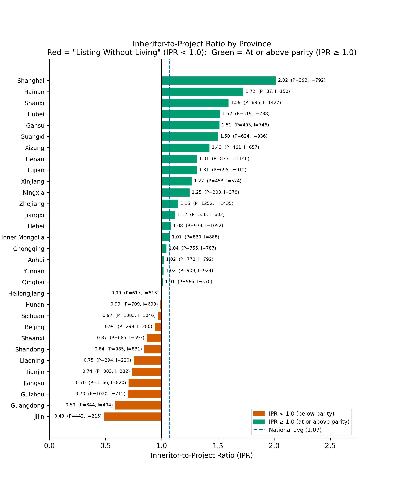
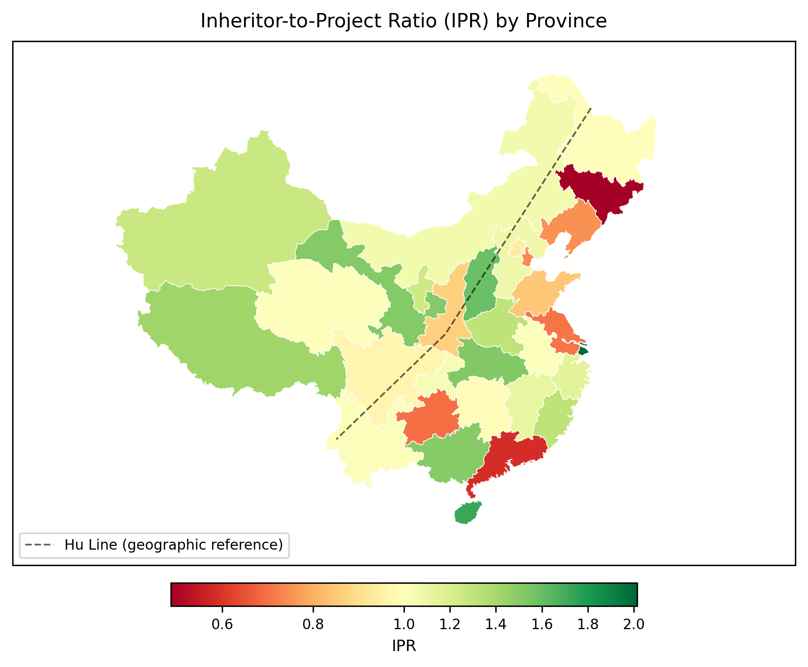
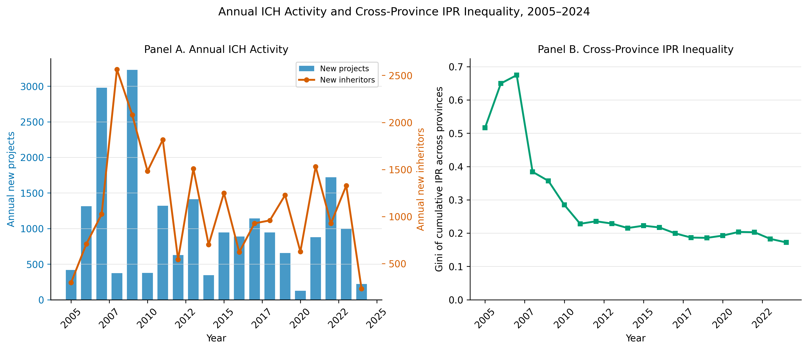
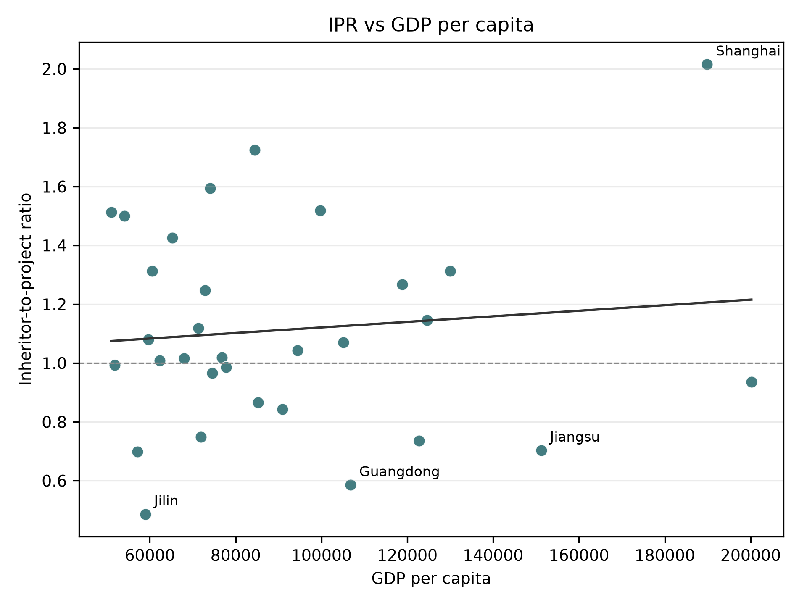

# Listing Without Living

Provincial intangible cultural heritage certification and inheritor allocation in mainland China, 2005-2024.

This repository is a public research portfolio version of a larger empirical project. It studies how officially listed intangible cultural heritage projects are paired with certified representative inheritors across China's 31 mainland provincial-level units. The core outcome is the inheritor-to-project ratio, or IPR:

```text
IPR = certified representative inheritors / representative ICH projects
```

The public repository includes processed province-level data, selected final tables, publication-style figures, and a lightweight reproduction script. Raw third-party source files are not redistributed here.

## Research Question

China's intangible cultural heritage system lists both representative projects and representative inheritors. A project can be formally recognized without a proportional base of certified living transmitters. This project asks where that gap is largest, whether it is regionally patterned, and how it relates to economic and cultural-capacity indicators.

## Headline Findings

- The final analysis sample covers 20,924 provincial ICH project records and 22,361 certified inheritor records across 31 mainland provinces.
- The national inheritor-to-project ratio is 1.069.
- The lowest IPR provinces include Jilin (0.486), Guangdong (0.585), Guizhou (0.698), Jiangsu (0.703), and Tianjin (0.736).
- The highest IPR provinces include Shanghai (2.015), Hainan (1.724), Shanxi (1.594), Hubei (1.518), and Gansu (1.513).
- All three Northeast provinces are below parity; the Northeast regional aggregate IPR is 0.775.
- GDP per capita alone does not explain the allocation pattern. Several wealthy eastern provinces remain below parity.

## Repository Structure

```text
analysis/              Clean public reproduction script
data/processed/        Processed province-level and province-year data
docs/                  Data and reproducibility notes
figures/               Selected final figures for viewing in GitHub
tables/                Final CSV and LaTeX tables used in the paper draft
```

## Selected Figures

### Provincial IPR Ranking



### Spatial Pattern of IPR



### Time Trend



### IPR and GDP per Capita



## Data

The public data are processed, aggregated research files:

- `data/processed/province_ipr_final.csv`: province-level final analysis data.
- `data/processed/province_year_panel.csv`: province-year cumulative IPR panel.
- `data/processed/ipr_by_batch.csv`: batch-level project and inheritor counts.
- `data/processed/fig_5_source_data.csv`: source data for the GDP per capita scatter plot.

See `docs/data_note.md` for variable notes and source limitations.

## Reproducing Public Figures

Install dependencies and run:

```bash
pip install -r requirements.txt
python analysis/reproduce_public_figures.py
```

The script writes regenerated figures to `output/reproduced_figures/`. The maps in `figures/` are included as static exports because the public repository does not redistribute geographic boundary source files.

## Notes

This public repository is designed for academic and professional review. It omits raw source datasets, local workflow logs, and private revision files. The full working repository is maintained separately.
